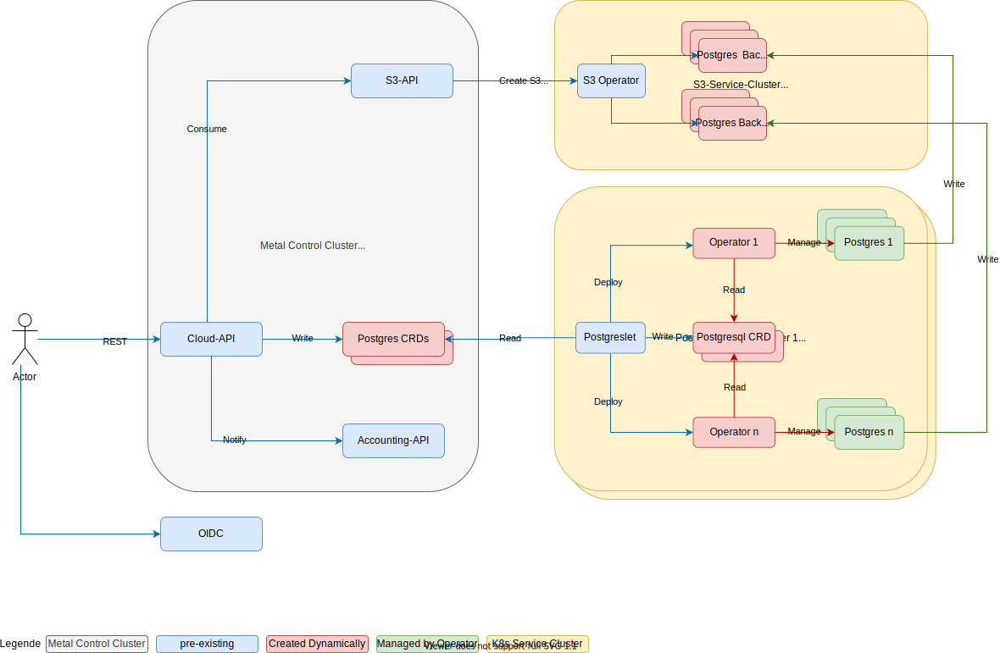

# postgreslet

*Postgreslet* contains a *kubernetes* controller which reconciles instances of *FI-TS CustomResourceDefinition postgres* by using [*Zalando postgres operator*](https://github.com/zalando/postgres-operator). .

## Architecture

*Postgreslet* is a *kubernetes deployment*, residing in every cluster on *FT-TS Cloud*. It watches *crd postgres* instances created in the *control plane cluster* and creates a series of *kubernetes* resources for each instance in the *service cluster*. One of them is the *Zalando postgres operator* which manages the *postgres database pod(s)*. More information can be found in [ARCHITECTURE.md](https://github.com/fi-ts/postgreslet/blob/main/docs/ARCHITECTURE.md).


## Demo

*Postgres* is highly integrated with [*FI-TS cloudctl*](https://github.com/fi-ts/cloudctl) and *cloudapi*, but we can still try it out with [*kubectl*](https://kubernetes.io/docs/tasks/tools/) on top of [*kind*](https://kind.sigs.k8s.io/docs/user/quick-start/#installation).

The instance we're going to create in the control-plane-cluster:
```yaml
apiVersion: database.fits.cloud/v1
kind: Postgres
metadata:
  namespace: metal-extension-cloud
  name: complete
spec:
  accessList:
    sourceRanges:
    - 1.2.3.4/24
  maintenance:
    - "Sun:21:00-22:00"
  numberOfInstances: 2
  partitionID: sample-partition
  projectID: sample-project
  size:
    cpu: 500m
    memory: 512Mi
    storageSize: 1Gi
  tenant: sample-tenant
  version: "12"
```

We assume *kubectl* and *kind* had already installed. Then, the single command to create two *kind* clusters, deploy *postgreslet*, and create an *postgres* instance:
```bash
make two-kind-clusters
```

Check the results in the control-plane-cluster.
```bash
watch kubectl --kubeconfig kubeconfig get postgres -A
```

Eventually, the result reads:
```bash
NAMESPACE               NAME       TENANT          VERSION   REPLICAS   IP    PORT    STATUS
metal-extension-cloud   complete   sample-tenant   12        2                32000   Running
```

Check the results in the service-cluster.
```bash
watch kubectl get pod -A
```

Eventually, the results read:
```bash
NAMESPACE                            NAME                                         READY   STATUS    RESTARTS   AGE
kube-system                          coredns-f9fd979d6-6gbfn                      1/1     Running   0          62s
kube-system                          coredns-f9fd979d6-p8gbc                      1/1     Running   0          62s
kube-system                          etcd-kind-control-plane                      1/1     Running   0          67s
kube-system                          kindnet-7tdn9                                1/1     Running   0          62s
kube-system                          kube-apiserver-kind-control-plane            1/1     Running   0          67s
kube-system                          kube-controller-manager-kind-control-plane   0/1     Running   0          66s
kube-system                          kube-proxy-728df                             1/1     Running   0          62s
kube-system                          kube-scheduler-kind-control-plane            0/1     Running   0          66s
local-path-storage                   local-path-provisioner-78776bfc44-t5sjh      1/1     Running   0          62s
postgreslet-system                   postgreslet-8464df785c-2cf55                 1/1     Running   0          62s
sampleproject-bd8ff6bd0a2d4edf96f4   postgres-operator-7c45557b9b-xhqgf           1/1     Running   0          52s
sampleproject-bd8ff6bd0a2d4edf96f4   sampleproject-bd8ff6bd0a2d4edf96f4-0         3/3     Running   0          43s
sampleproject-bd8ff6bd0a2d4edf96f4   sampleproject-bd8ff6bd0a2d4edf96f4-1         3/3     Running   0          6s
```
The *postgreslet* and the corresponding *pods* to the *postgres* instance, i.e. *postgres-operator* and database instances, can be observed.

## cloudctl

In production, [cloudctl](https://github.com/fi-ts/cloudctl) is the client. More info can be found with:
```bash
cloudctl postgres --help
```
